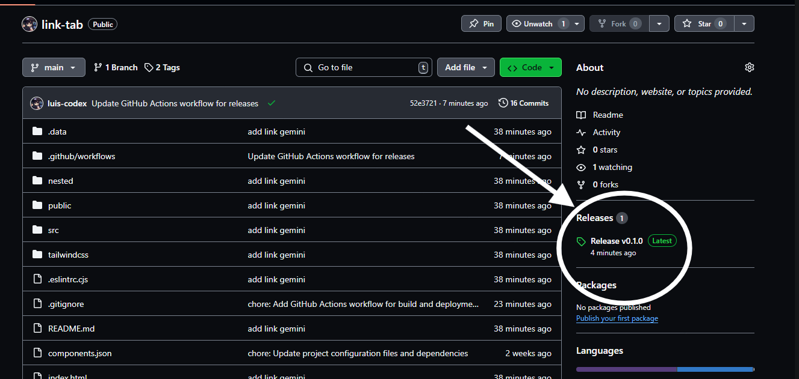
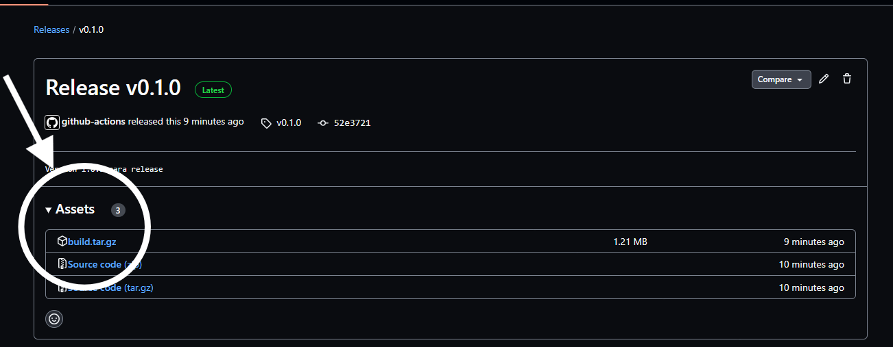
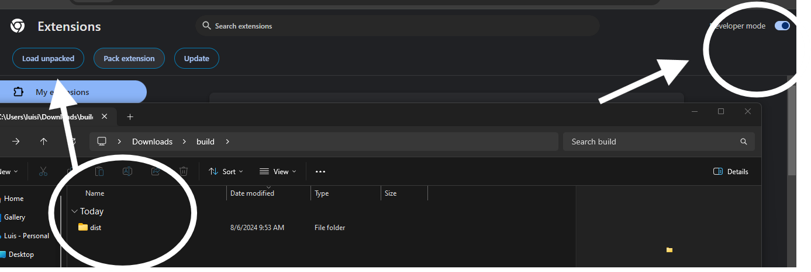

# link-tab  (alpha v0.1.0)

## Descripción
 una extensión de navegador que optimiza la gestión de pestañas y marcadores con inteligencia artificial, ofreciendo sugerencias inteligentes de enlaces para una navegación más eficiente y organizada.

Una extensión que permite a los usuarios organizar sus pestañas y marcadores de manera intuitiva, facilitando el acceso rápido a la información importante.

La extensión utiliza inteligencia artificial para analizar los marcadores guardados y ofrecer sugerencias relevantes y útiles basado en los patrones de uso y los intereses del usuario, 

## Instalación

1. Ve a la sección de releases y descarga el archivo comprimido.

    
    

2. Descomprime el archivo en la carpeta que desees y sube el descomprimido a la sección de extensiones de chrome `chrome://extensions/`. Asegurate de tener activado el modo desarrollador.

    

## video de demostración de uso:

https://github.com/user-attachments/assets/e5ddb7cc-3265-414d-8af4-b58a3116e940

😀✨ Gracias por revisar el proyecto. Además, pido disculpas por trabarme al hablar durante el video tutorial. Era mi primera vez haciendo un video y me puse nervioso, y tuve algunos problemas para expresarme correctamente 😣🥲.
